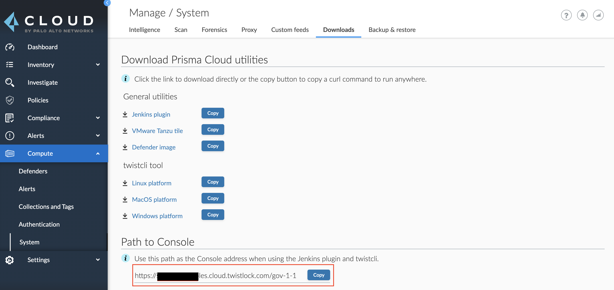

### How to Evaluate `<CONSOLE>`

All the example API commands is these documents specify a `<CONSOLE>` variable, which represents the address for your Console.
The Console address will depend on how your Console was installed.

#### For SaaS Installations

To find your `<CONSOLE>` path for a SaaS environment:

1. Log into your Console
2. Navigate to **Compute** > **Manage** > **System** > **Downloads**.
3. You can find your `<CONSOLE>` path listed under **Path to Console**. Click **Copy** to quickly copy the path to your clipboard.




#### For Self-hosted Installations

For self-hosted environments, the Prisma Cloud Compute API is exposed on port 8083 (HTTPS).
This port is specified at install time in `twistlock.cfg`.

* **(Default) Kubernetes installations:** The Console service is exposed by a LoadBalancer.
	
	The value for `<CONSOLE>` is the LoadBalancer followed by port `8083`:

	```
	https://<LOAD_BALANCER>:8083
	```

* **Onebox installations:** This is a Console installed on a stand-alone host.

	The value for `<CONSOLE>` is the IP address or DNS name of the host followed by port `8083`:

	```
	https://<IP_ADDRESS>:8083
	```


### API Restrictions

Paginated API requests are capped to a max of 50 returned objects because very large responses could DoS your Console.

If the response contains more than 50 objects, cycle through the collection with the `offset` query parameter to retrieve more objects.
For example:

```
https://<CONSOLE>/api/v1/images?limit=50&offset=X
```